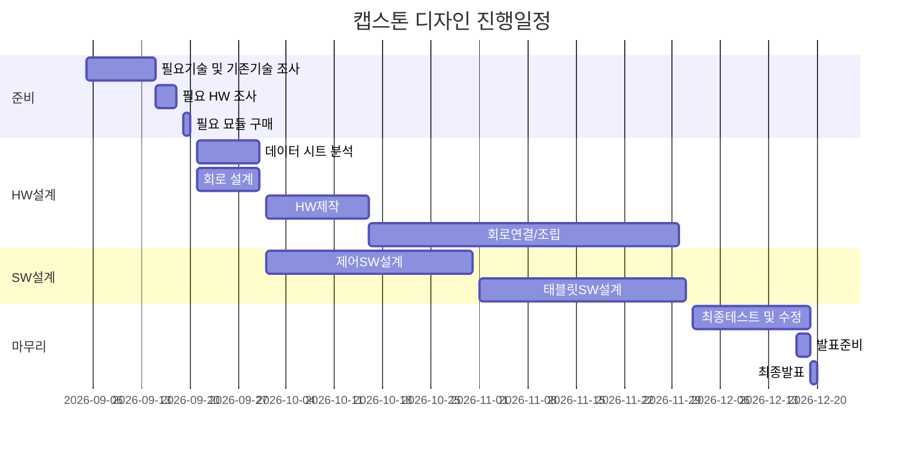

```mermaid
gantt
    title 캡스톤 디자인 진행일정
    dateFormat  MM/DD
    section 준비
    필요기술 및 기존기술 조사     :09/05, 10d
    필요 HW 조사 : 09/15, 3d
    필요 묘듈 구매 : 09/19, 1d
    section HW설계
    데이터 시트 분석 : 09/21, 9d
    회로 설계 : 09/21 ,9d
    HW제작     : 10/01  , 15d
    회로연결/조립 : 10/16, 45d
    section SW설계 
    제어SW설계 : 10/01, 30d
    태블릿SW설계 : 11/01,30d
    section 마무리
    최종테스트 및 수정     :12/02  , 17d
    발표준비 : 12/17, 2d
    최종발표     : 12/19, 1d
```